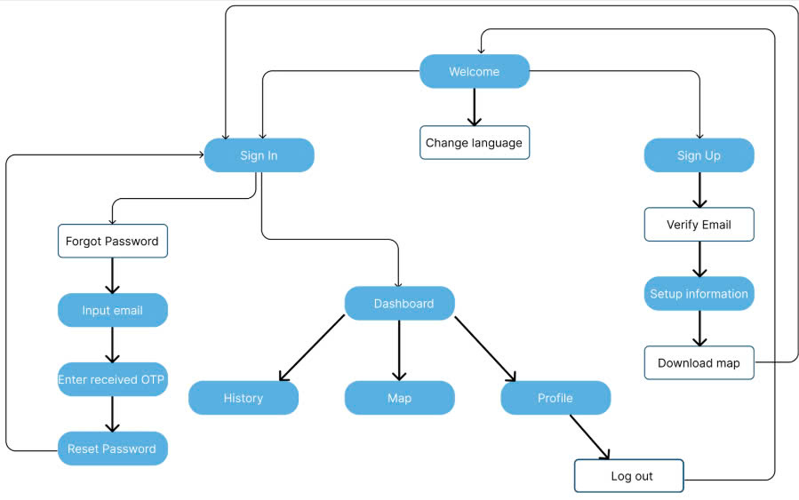
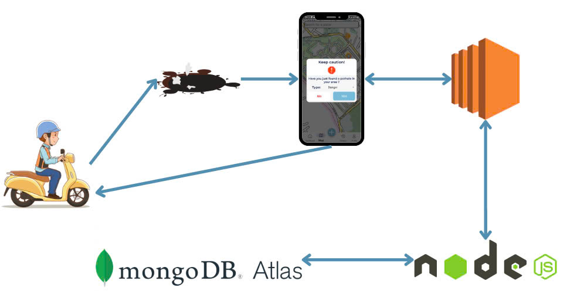
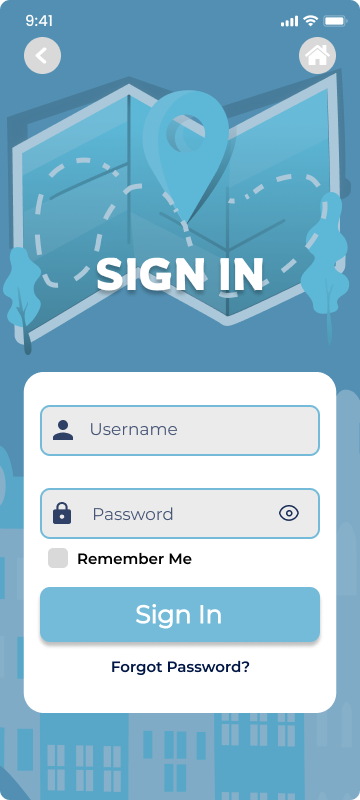
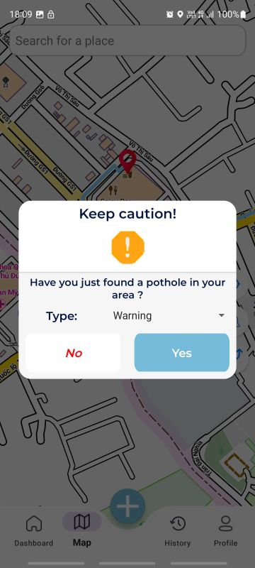

# 🕳️ Ứng dụng Phát hiện Ổ Gà tại Làng Đại Học – UIT

Hệ thống gồm hai phần:

- **Ứng dụng Android**: Phát hiện ổ gà bằng cảm biến điện thoại và hiển thị chúng trên bản đồ offline.
- **Server Node.js**: Nhận dữ liệu từ ứng dụng, xử lý đăng nhập/đăng ký người dùng và lưu trữ thông tin vào MongoDB.

---

## 📱 FinalProject_android – Ứng dụng Android

### 🚀 Tính năng chính

- Phát hiện ổ gà bằng cảm biến gia tốc (Accelerometer).
- Hiển thị ổ gà trên bản đồ offline, chỉ giới hạn trong khu vực Làng Đại Học.
- Gửi dữ liệu vị trí và độ rung đến server Node.js qua Retrofit.
- Cho phép người dùng đăng ký, đăng nhập và xem lại thông tin các ổ gà đã ghi nhận.

### 🛠️ Công nghệ sử dụng

- Java (Android Studio)
- SensorManager (gia tốc kế)
- MapsForge hoặc OpenStreetMap (bản đồ offline)
- Retrofit (kết nối API)
- BottomSheetDialog, Fragment, ViewModel,...

### 🗂️ Hướng dẫn sử dụng

1. Clone dự án Android:
   ```bash
   git clone https://github.com/yourusername/FinalProject_android.git
   ```
2. Mở bằng Android Studio.
3. Thêm file bản đồ `.map` hoặc `.osm` vào thư mục `assets/`.
4. Cập nhật địa chỉ server trong `RetrofitClient.java`:
   ```java
   private static final String BASE_URL = "https://<ngrok-or-render-url>";
   ```
5. Cấp quyền trong `AndroidManifest.xml`:
   ```xml
   <uses-permission android:name="android.permission.ACCESS_FINE_LOCATION"/>
   <uses-permission android:name="android.permission.BODY_SENSORS"/>
   <uses-permission android:name="android.permission.INTERNET"/>
   ```

### 🗺️ Khu vực hoạt động

- Bản đồ offline giới hạn trong khu vực **Làng Đại Học**:
  - Kinh độ: `106.743 → 106.834`
  - Vĩ độ: `10.845 → 10.903`
- Bản đồ được tải từ: [https://extract.bbbike.org](https://extract.bbbike.org)

---

## 🌐 Potholes_Android_Server – Backend Node.js

### ⚙️ Chức năng

- API RESTful cho ứng dụng di động
- Đăng ký, đăng nhập, xác minh email (qua link xác thực)
- Lưu trữ thông tin ổ gà và người dùng trong MongoDB

### 🛠️ Công nghệ

- Node.js + Express.js
- MongoDB + Mongoose
- JWT (xác thực)
- Nodemailer (gửi email xác minh)
- Dotenv (biến môi trường)

### 📦 Cài đặt backend

1. Clone dự án:

   ```bash
   git clone https://github.com/phantrananhnguyen/Android_NT118.git
   cd Potholes_Android_Server
   npm install
   ```

2. Tạo file `.env`:

   ```env
   PORT=3000
   MONGODB_URI=mongodb+srv://<user>:<pass>@cluster.mongodb.net/<dbname>?retryWrites=true&w=majority
   JWT_SECRET=your_jwt_secret
   EMAIL_USER=your_email@gmail.com
   EMAIL_PASS=your_email_password
   ```

3. Chạy server:

   ```bash
   node server.js
   ```

4. (Tuỳ chọn) Mở server cho Android dùng thử qua ngrok:
   ```bash
   ngrok http 3000
   ```

## 📡 API Android ↔ Server

| Method | Endpoint                               | Mô tả                           |
| ------ | -------------------------------------- | ------------------------------- |
| POST   | `/api/auth/signup`                     | Đăng ký tài khoản               |
| POST   | `/api/auth/login`                      | Đăng nhập                       |
| POST   | `/api/auth/forgot-password`            | Quên mật khẩu                   |
| POST   | `/api/auth/verify-code`                | Xác minh mã                     |
| POST   | `/api/auth/reset-password`             | Đặt lại mật khẩu                |
| GET    | `/api/auth/verify-email`               | Xác minh email qua link         |
| GET    | `/api/auth/check-verification-status`  | Kiểm tra email đã xác minh chưa |
| POST   | `/api/hole/add`                        | Gửi dữ liệu ổ gà                |
| GET    | `/api/hole/add`                        | Lấy dữ liệu ổ gà toàn khu       |
| GET    | `/api/search/`                         | Tìm kiếm địa điểm               |
| GET    | `/api/navigation`                      | Điều hướng từ A đến B           |
| GET    | `/api/history/history`                 | Xem lịch sử người dùng          |
| GET    | `/api/download-map`                    | Tải bản đồ offline              |
| GET    | `/api/profile/get`                     | Lấy thông tin người dùng        |
| PUT    | `/api/profile/update`                  | Cập nhật hồ sơ (multipart)      |
| GET    | `/api/user/profile-picture/{username}` | Lấy avatar người dùng           |
| GET    | `/api/hole/person`                     | Ổ gà do user gửi lên            |
| GET    | `/api/journey/current_user`            | Hành trình của người dùng       |
| POST   | `/api/journey/add`                     | Gửi dữ liệu hành trình          |

---

## Sơ đồ người dùng



## Sơ đồ hệ thống



## 🧪 Kiểm thử & Triển khai

- Dữ liệu test có thể gửi từ thiết bị Android thật hoặc giả lập có hỗ trợ cảm biến.
- Server có thể triển khai bằng:
  - Ngrok (ngắn hạn, kiểm thử nhanh)
  - AWS

---

## 📌 Ghi chú

- Ứng dụng cần chạy trên thiết bị có cảm biến gia tốc (Accelerometer).
- Khi bật app, ổ gà sẽ được phát hiện nếu rung vượt ngưỡng và gửi về server.
- Người dùng phải xác minh email để đăng nhập thành công.
- Tất cả vị trí được lưu kèm timestamp và mức độ rung.

---

## 👨‍💻 Nhóm phát triển

- Phan Trần Anh Nguyên
- Huỳnh Thanh Long
- Phan Thị Bích Quyên
- Vũ Hoàng Mạnh

---

## 📸 Demo ứng dụng

### 🔍 Giao diện đăng nhập



### 🗺️ Giao diện bản đồ trong Làng Đại học


### 🚧 Ổ gà được phát hiện



---

## 📄 Giấy phép

Dự án chỉ sử dụng nội bộ cho mục đích học tập tại UIT.
